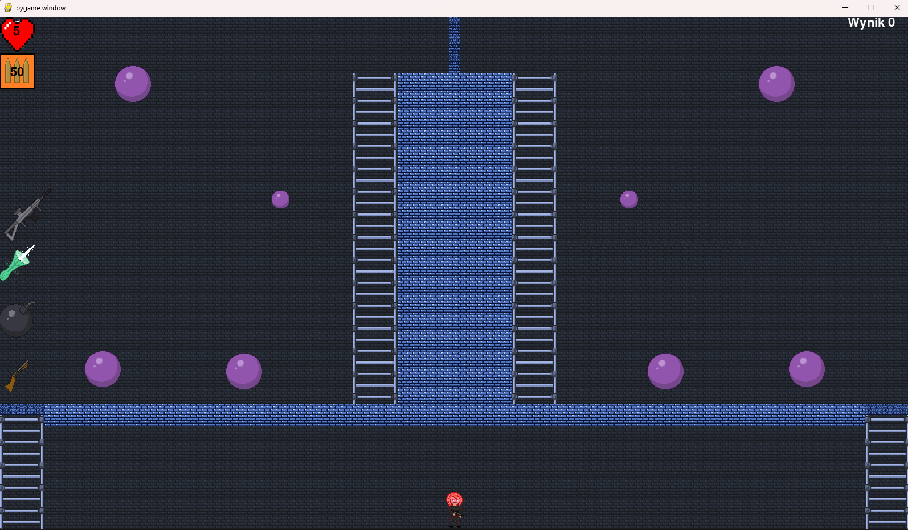
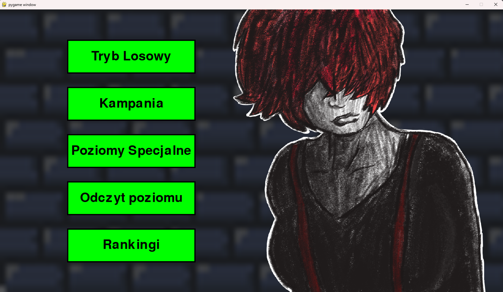

# # Pang Game Documentation
Game was written for Motrolla Science Cup 2022 and ended on second place. Goal of the game is to shoot all ballons, using different weapons. Some screens of the game:

### Authors:
- Filip Manijak
- Dawid Litwiniec
- Igor Stec

---

## Table of Contents
1. [Application Overview](#application-overview)
    - [Game Module](#game-module)
    - [Lobby Module](#lobby-module)
    - [Pause Module](#pause-module)
    - [Save and Load Module](#save-and-load-module)
    - [Ranking Module](#ranking-module)
2. [Classes and Functions](#classes-and-functions)
3. [Running the Application](#running-the-application)
    - [From Source Code](#from-source-code)
    - [From Executable File](#from-executable-file)

---

## Application Overview

The Pang game application consists of five main modules:
- **Game Module** 
- **Lobby Module** 
- **Pause Module** 
- **Save and Load Module** 
- **Ranking Module**

### Game Module
- Levels are loaded from `.txt` files.
- Players move using the arrow keys and are restricted from Y-axis movement during gameplay.
- Objective: Destroy all the bouncing balls on the map.
- Players have four types of weapons:
  1. Pistol (`Q`)
  2. Laser (`W`)
  3. Bomb (`E`)
  4. Shotgun (`R`)
- Map elements include destructible walls, ladders (for vertical movement), spikes, artifacts, and ice.
- **Pause**: Press `Esc` to activate the pause panel.

### Lobby Module
- Accessed upon starting `pang.exe`. Options include:
  1. **Random Mode**: Random map based on difficulty.
  2. **Campaign Mode**: Progress through 15 levels.
  3. **Special Levels**: Access to five unique levels.
  4. **Load Game**: Resume a previously saved game.
  5. **Rankings**: View high scores for all game modes.

### Pause Module
- Accessible via `Esc` during gameplay.
- Options:
  - Resume (`Continue`)
  - Save (`Save`)
  - Exit to main lobby

### Save and Load Module
- Contains five save slots.
- Each slot can be saved, loaded, or deleted.

### Ranking Module
- Scores are calculated based on completion time and saved if among the top 10.
- Rankings for each game mode can be viewed from the lobby.

---

## Classes and Functions

### Classes
- `Ball`: Handles ball behavior (`move()`)
- `Projectile` & `ShotgunProjectile`: Manage bullet movement (`move()`)
- `Player`: Handles player actions and drawing graphics.
- `Rectangle`, `Ladder`, `Spike`, `Artifact`, `Ice`: Specialized map elements.
- `Laser`, `Bomb`: Specific weapon functionalities.
- `Button`: GUI interaction (`draw()`, `isOver()`).

### Key Functions
- **Display**: `DrawHearts()`, `DrawAmmo()`, `PauseMenu()`, `ShowRanking()`
- **Save/Load**: `Save()`, `Load()`, `SaveLobby()`, `LoadLobby()`
- **Game Mechanics**: `Game()`, `CollisionDetection()`, `Victory()`, `Defeat()`
- **GUI**: `Lobby()`, `ModuleLobbyX()`

---

## Running the Application

### 1. From Source Code
- Requirements:
  - Python 3.10 (recommended)
  - PyGame 2.1.2 (recommended)
- Folder Structure:
  - Main `.py` file along with subfolders:
    - `Graphics`
    - `Levels`
    - `Rankings`
    - `SavedGames`

### 2. From Executable File
- Simply run `pang.exe` from the built folder.
- Required folders:
  - `Graphics`
  - `Levels`
  - `Rankings`
  - `SavedGames`

The game can be started in **fullscreen** or **windowed mode**, configured via `settings.txt`:
- `Fullscreen`: `True`
- `Windowed`: `1600x900`

---

Enjoy playing Pang!
